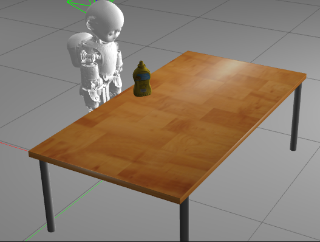

# EPR Assignment on Model Alignment

## :information_source: Intro

Within this assignment you will let the iCub perform _3D model alignment_ within the `Gazebo` simulation environment.
To this end, the robot stands in a world consisting of a table and an object (i.e. a mustard bottle from the YCB dataset) located on it:

<p align="center">  </p>

The 3D point cloud of the scene is acquired from the iCub cameras and processed in order to segment out the object from the table.
Your objective is to load the mesh created during the CAD design course and use the `Iterative Closest Point (ICP)` to align it with the object point cloud.

## :books: Theoretical background

The [`Iterative Closest Point`](https://en.wikipedia.org/wiki/Iterative_closest_point) algorithm aims at computing the optimal transformation (rotation and translation) between two point clouds allowing to align the two. Specifically, one point cloud is kept fixed (i.e. the _target_), while the other is transformed (i.e. the _source_), through two steps:
- **data association**: points in the two point clouds are associated using the nearest neighbor criteria;
- **transformation**: the roto-translation matrix minimizing the sum of squared differences between the matched pairs is computed.

The estimated transformation is applied to the source point cloud and the afore-mentioned steps are repeated _iteratively_, until the algorithm _converges_ to the best solution, which is found if one of the following criteria is met:
- the **number of iterations** has reached the maximum number of iterations;
- the **epsilon difference** between the previous and the current transformation is lower than a predefined threshold;
- the **sum of the Euclidean squared differences** is smaller than a predefined threshold.  

## :dart: Objectives
We ask you to exploit the [`PCL`](https://pointclouds.org/documentation/) library in order to:

- **load** the `STL` mesh of the object;
- **convert** it to a 3D point cloud;
- use the [`Iterative Closest Point`](https://pointclouds.org/documentation/classpcl_1_1_iterative_closest_point.html) class to **align** the model and object's point cloud;

## :point_up: How to proceed

We provide you with a starter code containing missing gaps you will have to fill in.
Your tasks will be:

**Read depth image from a Yarp port**:

The depth image is required to create the 3D point cloud.
While developing your code, you are required to read it from a `BufferedPort<ImageOf<PixelFloat>>`.

**Perform model alignment**:

In order to perform the alignment, we provide you with a set of services you can access by typing:

```
yarp rpc /model-alignment/rpc
```

You can rely on the following services:

 - `home`: to let the iCub gaze at the object;
 - `segment`: to segment out the object point cloud from the table;
 - `load_model assignment_model-alignment-mustard_bottle`: to load the mesh model. While developing your code, you will have to fill this function in order to:
     1. load the `STL` mesh of the object;
     2. convert it to a 3D point cloud.
 - `fit`: to perform the alignment. While developing your code, you will have to fill this function in order to:
     1. set `ICP` parameters;
     2. use `ICP` to align the point clouds.

 **Change object's position in the world**:

 You can try out several object's positions and check how the final alignment is affected, using one of the following approaches:

 - update _randomly_ the object's position with the `randomize` service we provided;
 - write a _desired position_ as `x y z roll pitch yaw` onto a Yarp `BufferedPort<Bottle>` port, by typing;

     ```
     yarp write ... /assignment_model-alignment-mustard_bottle/mover:i
     ```

**Note** :memo: : the frame is defined with respect to the robot, with `x` pointing backward, `y` pointing to the right and `z` pointing up.

Once done, you can test your code in two ways:

- **manually**: running the `yarpmanager` scripts provided within [`app/scripts`](https://github.com/easy-peasy-robotics/solution_model-alignment/tree/master/app/scripts). This will help you to interact with the code.
- **automatically**: running the script `test.sh` in the _smoke-test_ directory. This will give you an idea of how many points you might score.

## :heavy_check_mark: Expected output

At the end of your test, you should get the following output, with the model (red) aligned to the object point cloud (green):

<p align="center">

</p>

**Note** :memo: : you can interact with the 3D viewer (zoom in, zoom out, rotate).

## :trophy: Requirements to meet

The test is considered fully passed if you are able to:

1. _load_ the mesh model correctly and convert it to a point cloud;
2. select the correct _set of parameters_ for `ICP`;
3. get a reasonable _alignment score_ over 5 attempts.

The following is the score map:

| Requirements  | Points |
|:-------------:|:------:|
|      1        |    5   |
|      2        |    8   |
|      3        |   20   |
| **Maximum score** |   33   |

**Note** :warning: : the points you will get for point 3 are averaged over the 5 attempts.
